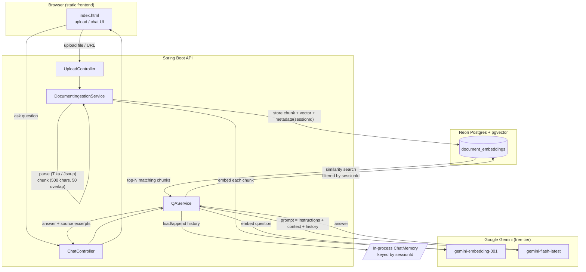

# DocQA — Document Q&A with RAG (Java + LangChain4j)

A personal Retrieval-Augmented Generation (RAG) service. Upload files or webpages,
then ask questions answered strictly from that content, with conversational
follow-up support.

## 1. Overview

| | |
|---|---|
| **Problem** | Answer questions grounded in user-supplied documents, not general model knowledge. |
| **Approach** | Parse → chunk → embed → store in a vector database → retrieve top-matching chunks per question → answer via LLM using only that context. |
| **Language/Framework** | Java 17, Spring Boot 3 |
| **LLM orchestration** | LangChain4j |
| **LLM provider** | Google Gemini (free tier, Google AI Studio) |
| **Vector store** | pgvector on Neon (serverless Postgres) |
| **Document parsing** | Apache Tika (files), Jsoup (webpages) |
| **Deployment target** | Render (Docker) |

## 2. Architecture



**Request flow in words:**

1. **Ingestion** — a file or URL is parsed to plain text, split into ~500-character
   overlapping chunks, embedded via Gemini, and stored in pgvector tagged with a
   `sessionId` in its metadata.
2. **Retrieval** — a question is embedded the same way, and pgvector's similarity
   search returns the top matching chunks, **filtered to only that `sessionId`**
   so different sessions never see each other's documents.
3. **Generation** — the retrieved chunks, the running chat history for that
   session, and the question are assembled into one prompt and sent to Gemini,
   which is instructed to answer only from that context.
4. **Memory** — each session keeps a rolling window of its last ~10 exchanges
   in-process (`ConcurrentHashMap<sessionId, ChatMemory>`), so follow-up
   questions like "what about the second one?" resolve correctly.

## 3. Project layout

```
src/main/java/com/example/docqa/
  DocQaApplication.java              - entry point
  config/
    LangChain4jConfig.java          - Gemini chat/embedding beans, pgvector store bean
    GlobalExceptionHandler.java     - consistent JSON error responses
  controller/
    UploadController.java          - POST /api/documents/upload, /ingest-url, DELETE /session/{id}
    ChatController.java            - POST /api/chat/ask
    HealthController.java          - GET /health (Render health check)
  service/
    DocumentIngestionService.java  - parsing, chunking, embedding, size limits, session clearing
    QAService.java                 - session-filtered retrieval, chat memory, LLM call
  model/                            - request/response DTOs
resources/
  application.properties            - all configuration (env-var driven)
  static/index.html                 - self-contained frontend (upload + chat), no build step
```

## 4. Key implementation details

### Session isolation
Every chunk is tagged with a `sessionId` in its metadata at ingestion time.
Retrieval always applies a `metadataKey("sessionId").isEqualTo(sessionId)` filter,
so one browser session's documents are never visible to another. The frontend
generates a UUID per session (stored in `localStorage`) and can clear + rotate it
via "new session," which deletes that session's chunks from pgvector.

### Chunking and retrieval tuning
| Setting | Value | Why |
|---|---|---|
| Chunk size | 800 chars | Balances precision vs. enough surrounding context |
| Chunk overlap | 100 chars | Avoids splitting a fact across a chunk boundary |
| Retrieved chunks per question | 6 | Enough for cross-document comparison without bloating the prompt/timeout risk |
| Min similarity score | 0.5 | Filters out unrelated chunks rather than forcing top-N regardless of relevance |

### Prompting
The system prompt explicitly allows the model to **synthesize** answers across
multiple chunks (not just quote a single matching sentence) and to give a
**grounded opinion** on subjective questions (e.g. "which resume is stronger"),
while still refusing to answer when the context genuinely has nothing relevant.
Output length is capped (`maxOutputTokens`) to keep response time predictable.

### Resilience
- **Timeouts**: chat calls use a 180s client timeout — long enough for
  reasoning-heavy prompts on a free-tier model, which can be slower than paid tiers.
- **Rate limits**: Gemini's free tier enforces a requests-per-minute cap; a 429
  is caught and surfaced as a clear "you've hit the rate limit, wait and retry"
  message rather than a raw API error.
- **Blocked/unreachable URLs**: sites that require login or block automated
  fetches (common with social platforms) fail with a message suggesting a file
  upload instead, rather than a raw HTTP status code.

### Upload limits
File size is capped at 10MB, enforced at both the HTTP layer
(`spring.servlet.multipart.max-file-size`) and independently inside
`DocumentIngestionService` (defense-in-depth — a misconfigured multipart
setting alone can't silently allow oversized files through).

## 5. Local setup

### Prerequisites
- Java 17+, Maven 3.9+
- A free [Google AI Studio](https://ai.google.dev/gemini-api/docs/api-key) API key
- A free [Neon](https://neon.tech) Postgres project with the `vector` extension enabled:
```sql
  CREATE EXTENSION IF NOT EXISTS vector;
```

### Environment variables

```bash
export GEMINI_API_KEY=your-gemini-key
export PGVECTOR_HOST=your-neon-host
export PGVECTOR_PORT=5432
export PGVECTOR_DB=neondb
export PGVECTOR_USER=your-neon-user
export PGVECTOR_PASSWORD=your-neon-password
```

Open `http://localhost:8080` — the frontend is served automatically.

## 6. API reference

| Method | Path | Body | Purpose |
|---|---|---|---|
| `POST` | `/api/documents/upload` | multipart: `file`, `sessionId` | Index an uploaded file |
| `POST` | `/api/documents/ingest-url` | `{ "url", "sessionId" }` | Index a webpage |
| `DELETE` | `/api/documents/session/{sessionId}` | — | Delete all chunks for a session |
| `POST` | `/api/chat/ask` | `{ "sessionId", "question" }` | Ask a question, get an answer + source excerpts |
| `GET` | `/health` | — | Health check |

## 7. Known limitations

- **Chat memory is in-process** — resets on app restart, and won't be shared
  across instances if ever scaled beyond one Render instance.
- **Free-tier rate limits** — Gemini's free tier caps requests per minute;
  expect occasional 429s under rapid testing (handled gracefully, but real).
- **Neon free tier auto-suspends** on inactivity — first query after idle time
  has a brief (~1-2s) wake-up delay.
- **Login-walled sites** (LinkedIn, X/Twitter, etc.) can't be scraped via URL
  ingestion — upload the document directly instead.
- **No authentication** — `sessionId` is client-supplied and trusted as-is;
  fine for a personal single-user project, not suitable as-is for a multi-tenant
  public deployment.